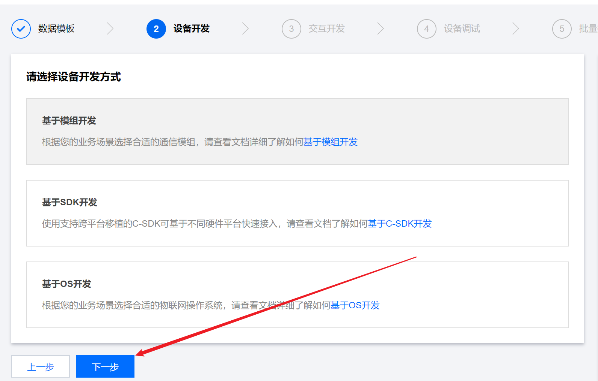

[TOC]

# 腾讯IOT之树莓派物联网设备

本次实验的目的是将**树莓派**设置为一个**物联网终端**，通过微信小程序可以控制树莓派，实现蜂鸣器的开关。

微信小程序界面如下所示，点击这个开关，就可以控制蜂鸣器。


项目地址：https://github.com/xiaohuiduan/IotForTecentBeep


## 架构图

一图胜千言：


## 硬件配置

1. 树莓派
2. 蜂鸣器

在这里我将树莓派接的是`GPIO_00`，使用的树莓派是树莓派4B版本。不同的树莓派的GPIO接口可能不同，可以根据自己的需要按情况考虑。

实物图如下所示，VCC——3.3V ，GND ——GND，IO——GPIO_00（低电平触发）


## 软件配置

编程语言使用的是Java，也就是说将使用Java实现腾讯云IOT平台的连接和树莓派GPIO口的控制。使用的IDE是`IntelliJ IDEA`。


## Tecent IOT 开发平台的使用

Tecent IOT开发平台的官方参考文档网址：[https://cloud.tencent.com/document/product/1081](https://cloud.tencent.com/document/product/1081)，不过个人觉得其文档对于Java SDK的描述不够详细，建议去看其 [Demo ](https://github.com/tencentyun/iot-device-java/tree/master/explorer/explorer-device-android)源码才能明白其工作流程。

腾讯云IOT开发平台的项目结构如下所示：分为两层——`项目` 和 `产品`。在使用其平台的时候，既需要创建project，也需要创建product。


> 我们可以将**项目**理解为智能家居整个系统，因此在项目中有很多**产品**，比如说智能空调，智能报警器等等产品。而在空调中有温度、湿度等**属性**，同时也有着开关等**控制器**。
>
> 而在这篇博客中，项目名称是**物联网实训**，产品名为**树莓派**，但是树莓派只有一个**功能**——控制蜂鸣器。也就是说，没有**属性**，只有**控制器**。


### 新建项目

打开网址：[https://console.cloud.tencent.com/iotexplorer](https://console.cloud.tencent.com/iotexplorer)新建项目，项目名称随意就行，创建好项目后，进入项目，然后创建产品。


### 新建产品

创建产品的选项如下：

- 设备：因为我们是准备将树莓派作为一台设备来使用的，因此，应该选择**”设备“**，当然，如果是准备将它作为网关，则看着选就行了。
- 认证方式：认证方式选择密钥认证，这样在代码中间直接写设备的密码就行，比证书稍微方便一点（不过实际上证书方便一点）。
- 数据协议：使用数据模板即可。


### 添加自定义功能

物联网设备，之所以叫物联网，是因为大家想把传感器获得的数据放在云端，或者通过云端去控制物联网设备。那么放什么数据，控制什么功能，则需要我们去定义。这里选择控制树莓派上面的蜂鸣器，因此只需要定义蜂鸣器即可。

在腾讯IOT中，可以使用`新建功能`定义这些功能。选择**属性**，数据类型选择**布尔型**（因为只有控制蜂鸣器的开/关）。请记住这个标识符`beep_switch`，这个将在后面的代码中用到。


关于功能类型的不同，可以参考下面的表格。（不过在个人看来，在他的官方 Demo 中，无论是物联设备的数据（比如说温度湿度），还是物联网的控制（比如说灯的开关），它都定义成为了属性。也就是说，尽管 **蜂鸣器的开关** 是人为下发的控制，但是还是定义为属性。至于事件和行为有什么作用，我也不清楚……)

> 以下来自官方文档
>
> | 功能元素 | 功能描述                                                     | 功能标识符   |
> | :------- | :----------------------------------------------------------- | :----------- |
> | 属性     | 用于描述设备的实时状态，支持读取和设置，如模式、亮度、开关等。 | PropertiesId |
> | 事件     | 用于描述设备运行时的事件，包括告警、信息和故障等三种事件类型，可添加多个输出参数，如环境传感器检测到空气质量很差，空调异常告警等。 | EventId      |
> | 行为     | 用于描述复杂的业务逻辑,可添加多个调用参数和返回参数,用于让设备执行某项特定的任务，例如，开锁动作需要知道是哪个用户在什么时间开锁，锁的状态如何等。 | ActionId     |


点击下一步，进入设备开发。


### 设备开发

因为这里使用的是Java SDK进行开发，没有使用模组也没有基于OS开发，因此直接点击下一步。



点击下一步就到了微信小程序配置。

### 微信小程序配置

腾讯IOT平台相比较于其他平台，有一个很大的特点就是可以很好的支持小程序。也就是说，在开发的阶段，就可以使用小程序去验证设备的功能。并且这个微信小程序不需要自己写样式代码，只需要进行简单的配置，就可以直接从小程序上面看到物联网设备的数据。

因为这里我们使用的数据很简单，只有开关，所以随便配置一下面板即可。


#### 面板配置

这里面板类型选择**标准面板**，简单的配置一下开关即可，效果图如右图所示。


保存退出之后，就进入到新建设备功能页面。

### 新建设备

>  新建设备`的意义：创建一个设备代表启动了一个账号（这个设备会提供一个密钥），我们的设备使用这个密钥，就可以让我们的设备连接腾讯云IOT平台进行数据交互。
>
>  从现实意义来说，就是我手中有一个树莓派，我需要让它连接腾讯云IOT平台，就需要账号密码，所以就需要创建一个设备。

新建设备的步骤如下所示：


### 使用设备

点击 **my_pi** ，进入设备管理。


设备管理界面如下所示：

- 设备信息：这里面是设备的一些基本属性，其中通过设备``名称``，`设备密钥`，和`产品ID`就可以唯一定位一个`设备`，然后对其进行操作。

- 设备日志：设备日志里面保存着设备的上行和下行数据。
- 在线调试：通过在线调试，可以模拟设备的行为，或者对设备下发控制命令。


### 在线调试

可以使用在线的调试功能对物联网设备进行功能下发。（比如说下发开关数据，控制蜂鸣器的开关）


### 设备日志

可以在设备中看到物联网设备与云平台之间的上行和下行数据。


🆗，以上的所有就是腾讯IOT平台的介绍，通过上面的操作，就可以创建一个设备，获得其name，key，id，然后对其进行开发。

## 树莓派Java开发

针对于树莓派开发，相信大家听过最多的都是Python开发，使用Python去控制树莓派的GPIO口，但是，因为腾讯提供的平台没有Python的SDK，因此，只能选择Java去控制树莓派的GPIO口。

[Pi4j](https://pi4j.com/1.2/index.html)是一个专门用来控制树莓派GPIO口的设备。关于使用安装可以去看[树莓派---JAVA操作GPIO](https://www.jianshu.com/p/0584f8b01725)（不过基本上比较新的树莓派系统都不需要安装了）。

因为我们是在Windows平台开发然后在树莓派上面运行Java程序（打包成jar运行），因此需要在树莓派上面安装Java环境（不过一般来说树莓派都自带了Java环境）。

### 创建项目

使用IDEA创建maven项目。


通过上述操作就创建一个Java maven项目。

### 配置maven文件

然后配置maven文件，也就是`pom.xml`，在其中导入依赖库，以及进行配置。


具体配置如下：

```xml
<?xml version="1.0" encoding="UTF-8"?>
<project xmlns="http://maven.apache.org/POM/4.0.0"
         xmlns:xsi="http://www.w3.org/2001/XMLSchema-instance"
         xsi:schemaLocation="http://maven.apache.org/POM/4.0.0 http://maven.apache.org/xsd/maven-4.0.0.xsd">
    <modelVersion>4.0.0</modelVersion>
    <build>
        <plugins>
            <plugin>
                <artifactId>maven-assembly-plugin</artifactId>
                <configuration>
                    <appendAssemblyId>false</appendAssemblyId>
                    <descriptorRefs>
                        <descriptorRef>jar-with-dependencies</descriptorRef>
                    </descriptorRefs>
                    <archive>
                        <manifest>
                            <!--注意，此处必须是main()方法对应类的完整路径  -->
                            <mainClass>Main</mainClass>
                        </manifest>
                    </archive>
                </configuration>
                <executions>
                    <execution>
                        <id>make-assembly</id>
                        <phase>package</phase>
                        <goals>
                            <goal>assembly</goal>
                        </goals>
                    </execution>
                </executions>
            </plugin>
        </plugins>
    </build>
	
    <!--    生成的包名-->
    <groupId>org.example</groupId>
    <artifactId>IotForTecentBeep</artifactId>
    <version>1.0-SNAPSHOT</version>

    <!--    添加依赖库-->
    <dependencies>
        <!--        腾讯IOT库-->
        <dependency>
            <groupId>com.tencent.iot.explorer</groupId>
            <artifactId>explorer-device-java</artifactId>
            <version>1.0.0</version>
        </dependency>
        <!--        树莓派GPIO 库-->
        <dependency>
            <groupId>com.pi4j</groupId>
            <artifactId>pi4j-core</artifactId>
            <version>1.2</version>
        </dependency>


    </dependencies>

</project>
```


### 项目文件配置

在项目的目录下面添加data.json文件。


data.json需要存放一些数据。这个数据实际上就是**自定义功能的json数据**，从页面复制之后粘贴到data.json文件中即可。


### 代码编写

使用Java编写代码，具体的解释可以看代码中间的注释。不过要注意，需要根据自己的设备情况更改如下的信息。


同时，在这个地方需要根据自己的情况修改。（尽管在云平台中定义的是布尔型数据，但是实际上腾讯云发送过来的是int类型数据。）


在代码中要注意，**必须**先订阅（也就是执行`subscribeTopic`函数），才能够进行接收到平台发送过来的数据。

```java
import com.pi4j.io.gpio.*;
import com.tencent.iot.explorer.device.java.common.Status;
import com.tencent.iot.explorer.device.java.data_template.TXDataTemplateDownStreamCallBack;
import com.tencent.iot.explorer.device.java.mqtt.TXMqttActionCallBack;
import com.tencent.iot.explorer.device.java.server.samples.data_template.DataTemplateSample;
import org.eclipse.paho.client.mqttv3.IMqttToken;
import org.eclipse.paho.client.mqttv3.MqttMessage;
import org.json.JSONObject;

/**
 * @author XiaoHui
 */
public class Main {
    /**
     * IOT平台URL
     */
    public static String mBrokerURL = "ssl://iotcloud-mqtt.gz.tencentdevices.com:8883";
    /**
     * 产品ID
     */
    public static String mProductID = "64ONICJ3N8";
    /**
     * 设备名称
     */
    public static String mDevName = "my_pi";
    /**
     * 设备密钥
     */
    public static String mDevPSK = "1ktYq8uojYiuJgX7iZxAoQ==";
    /**
     * 储存属性的json文件名
     */
    public static String mJsonFileName = "data.json";

    private static DataTemplateSample mDataTemplateSample;

    /**
     * 获得GPIO的控制器
     */
    public static final GpioController gpio = GpioFactory.getInstance();
    /**
     * GPIO输出，使用GPIO_00 ,默认输出为High
     */
    public static final GpioPinDigitalOutput beep = gpio.provisionDigitalOutputPin(RaspiPin.GPIO_00, "beep", PinState.HIGH);


    public static void main(String[] args) {
        // CallBack 代表的是MQTT协议的回调函数，MyDownCallback代表的是IOT平台下发消息的回调
        mDataTemplateSample = new DataTemplateSample(mBrokerURL, mProductID, mDevName, mDevPSK,
                null, null, new CallBack(), mJsonFileName, new MyDownCallback());
        // 进行连接
        mDataTemplateSample.connect();
        // 进行订阅，只有订阅后，消息才能下发。
        mDataTemplateSample.subscribeTopic();
        mDataTemplateSample.propertyClearControl();
    }

    /**
     * MQTT的回调函数，可以不用管
     */
    public static class CallBack extends TXMqttActionCallBack {

        @Override
        public void onConnectCompleted(Status status, boolean reconnect, Object userContext, String msg) {

        }

        @Override
        public void onConnectionLost(Throwable cause) {

        }

        @Override
        public void onDisconnectCompleted(Status status, Object userContext, String msg) {
        }

        @Override
        public void onPublishCompleted(Status status, IMqttToken token, Object userContext, String errMsg) {
        }

        @Override
        public void onSubscribeCompleted(Status status, IMqttToken asyncActionToken, Object userContext, String errMsg) {
        }

        @Override
        public void onMessageReceived(final String topic, final MqttMessage message) {

        }

    }

    /**
     * 实现下行消息处理的回调接口
     */
    private static class MyDownCallback extends TXDataTemplateDownStreamCallBack {

        @Override
        public void onReplyCallBack(String msg) {

        }

        @Override
        public void onGetStatusReplyCallBack(JSONObject data) {


        }

        /**
         * 在微信小程序点击关闭按钮后，IOT平台会向树莓派发送命令消息，此命令消息会在这这里进行回调
         * beep是低电平触发！！！！！！！！！！！！
         *
         * @param msg 接收到的消息。
         * @return
         */
        @Override
        public JSONObject onControlCallBack(JSONObject msg) {

			// 获得开关的数据，beep_switch是开关的标识符。尽管我们在云平台中定义的是布尔型数据，但是实际上腾讯云发送过来的是int类型数据。
            int power = msg.getInt("beep_switch");
            // 打开开关
            if (power == 1) {
                beep.low();
                System.out.println("打开");
            } else {
                // 关闭蜂鸣器
                beep.high();
                System.out.println("关闭");
            }
            // 返回消息
            JSONObject result = new JSONObject();
            result.put("code", 0);
            result.put("status", "ok");
            return result;
        }

        @Override
        public JSONObject onActionCallBack(String actionId, JSONObject params) {
           return null;
        }
    }

}

```

### 代码打包

因为我们的代码是在windows上面编译的，因此需要将其编译成jar文件，这个也就是之前配置`pom.xml`文件的原因。IDEA上面编译还是挺简单的，如下图所示：


经过如上的操作我们就将项目编译成了jar包，jar包在target目录下。


## 程序运行

将编译好的jar文件放到树莓派中，使用VNC或者XShell皆可。然后在jar包文件目录下使用如下命令：

```bash
java -jar 包名
```

此次项目生成的包名为`IotForTecentBeep-1.0-SNAPSHOT.jar`，因此命令如下所示：


当程序运行起来的时候，就可以在微信小程序或者在线调试工具中对蜂鸣器进行控制。

### 微信小程序控制

前面说了，可以是用微信小程序对开发的物联网设备进行开发调试，然后在如下的页面得到设备的二维码。


然后打开”腾讯连连“小程序，对二维码进行扫描，即可将设备加入。


点击中间的按钮就可以实现对蜂鸣器的控制了！！！


## 总结

相比较于上一篇[腾讯IOT安卓开发初探](https://www.cnblogs.com/xiaohuiduan/p/14244343.html)，这一次实现消息的下发接收控制。不过有一说一，官方文档是真的坑，连一个比较详细的说明文档都没有，还得自己一个一个Debug，查看为什么消息发送失败，查看为什么没有接收到下发的消息……

GitHub：[https://github.com/xiaohuiduan/IotForTecentBeep](https://github.com/xiaohuiduan/IotForTecentBeep)

### 参考

1. [腾讯IOT安卓开发初探](https://www.cnblogs.com/xiaohuiduan/p/14244343.html)

2. 物联网开发平台使用文档：[物联网开发平台 - 文档中心 - 腾讯云 (tencent.com)](https://cloud.tencent.com/document/product/1081)

3. Github：[iot-device-java](https://github.com/tencentyun/iot-device-java)

4. [树莓派4的GPIO接口介绍 – 八色木 (basemu.com)](https://www.basemu.com/raspberry-pi-4-gpio-pinout.html)

5. [树莓派---JAVA操作GPIO](https://www.jianshu.com/p/0584f8b01725)

   

   

   